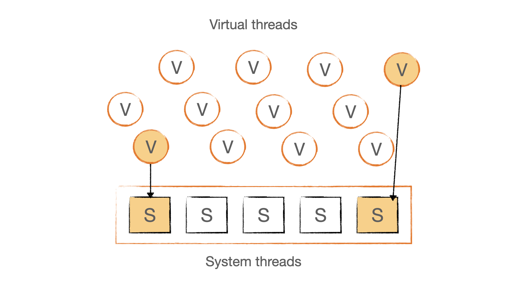
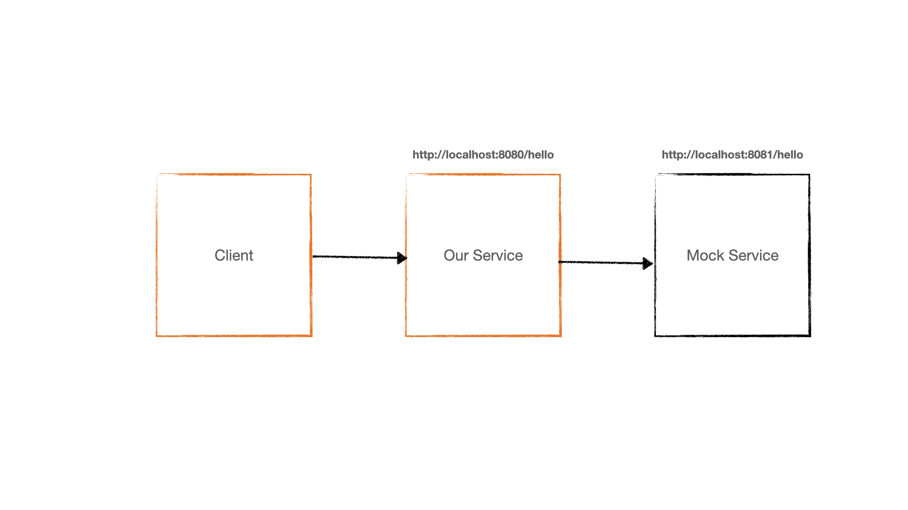

<style>
    section {
        justify-content: start;
    }
</style>

<!--  -->
<span style="color: black;">
Erwin de Gier<br/>
Software Architect<br/>
Trifork Amsterdam<br/>
</span>
<br/>
<br/>
<span style="text-align: right">
<h1>JAVA<span style="color: black;">WHAT<span></h1>
<h1>PROJECT<span style="color: black;">SHOULD<span></h1>
<h1>LOOM<span style="color: black;">I CARE?<span></h1>
</span>

<!--
Goodmorning My name is Erwin de Gier and I'm a Software architect at Trifork Amsterdam.
Today I want to talk about Project Loom and what it means for us as a developer.
-->

---

# What<span style="color: darkorange;">?</span>

<br>
Project Loom:

- JEP 425: Virtual Threads
- JEP 428: Structured Concurrency

<!--
Project Loom is an OpenJDK project that aims to add high-throughput lightweight concurrency and new programming models on the Java platform. It consists of two main parts:\
- Virtual Threads
- Structural Concurrency
-->

---

# Why<span style="color: darkorange;">?</span>

<br>

_"Project Loom aims to drastically reduce the effort of writing, maintaining, and observing high-throughput concurrent applications that make the best use of available hardware."_

— Ron Pressler (Tech lead, Project Loom)

<!--
Start with why
Though the concurrency model in Java is powerful and flexible as a feature, it was not the easiest to use, and the developer experience hasn’t been great.
-->

---

# The problem

- Latency due to network calls or IO
- Switching tasks to optimize resources and throughput
- Classic: multiple (OS) threads
- But.. OS threads are heavy, amount is limited (memory)

<!--
When our applications do Network or IO calls we experience latency where the application
has to wait for the call to response. During this time we can do other tasks to optimize
resources and throughput.
-->

---

# Possible solutions

- Callbacks
- Reactive

Both require a specific programming model. What if we could use our existing imperative mono thread model?

<!--Callback hell, requirement to determine blocking IO vs. non-blocking IO. changing existing applicaitons to reactive programming model-->

---

# Answer: Virtual Threads

Virtual Threads allows us to switch task on the platform level, using a synchronous code style like we are used to.

- low memory foot print
- Stack is stored in the heap, dynamic sized
- allows for creating for more threads than with platform threads due to lower memory requirements
- suspend and resume are fast operations

<!--
Virtual threads are user mode threads.

https://inside.java/2020/08/07/loom-performance/
-->

---

# Virtual threads map to system threads



---

# Use cases for virtual threads

<br>

- Serving content over the wire (e.g. web server)
  - Thread-per-request model
  - Thread pools
  - Asynchronous concurrency

---

# Programming model<span style="color: darkorange;">.</span>

- Asynchronous with callbacks:

```java
    public void callService(Consumer<String> callback);

    callService(
        result -> System.out.println(result);
    );
```

---

# Programming model<span style="color: darkorange;">.</span>

- Asynchronous with CompletableFutures

```java
    public CompletableFuture<String> callService();

    CompletableFuture cf = callService();
    System.out.println(cf.get())

```

---

# Programming model<span style="color: darkorange;">.</span>

- Reactive

```java
    public Mono<String> callService();

    callService().subscribe(
         result -> System.out.println(result)
    );
```

---

# Programming model<span style="color: darkorange;">.</span>

- Coroutines / async await (kotlin)

```kotlin
    suspend fun callService() : String

    async {
        println(callService)
    }
```

---

# Programming model<span style="color: darkorange;">.</span>

- Virtual threads

```java
    public String callService();

    System.out.println(callService());

    //Yes, it's the same as our current blocking code
```

<!--

Virtual Threads can change our perspective on asynchronous programming interfaces. The reasons to use asynchronous programming models go away in many cases if we start with the assumption that our code runs on Virtual Threads. Virtual Threads are much more lightweight to allocate, and the number of threads is no longer a primary limitation for scalability. To make things more clear, asynchronous programming models do not remove the latency of e.g. a network call. The asynchronous Apache HTTP Client or netty simply switches tasks if a network call cannot progress instead of blocking a Thread. And the same happens with Virtual Threads: They effectively yield towards another Runnable that can progress with its work.

Project Loom has revisited all areas in the Java runtime libraries that can block and updated the code to yield if the code encounters blocking. Java’s concurrency utils (e.g. ReentrantLock, CountDownLatch, CompletableFuture) can be used on Virtual Threads without blocking underlying Platform Threads. This change makes Future's .get() and .get(Long, TimeUnit) good citizens on Virtual Threads and removes the need for callback-driven usage of Futures.

Assumptions leading to the asynchronous Servlet API are subject to be invalidated with the introduction of Virtual Threads. The async Servlet API was introduced to release server threads so the server could continue serving requests while a worker thread continues working on the request. Running servlet request and response processing on a Virtual Thread removes the need to release server threads leading to the question, why to use ServletRequest.startAsync() at all, as asynchronous forking involves a lot of state-saving that could be eliminated as it would be no longer required.
-->

---

# Creating Virtual Threads (low level)

```java
var virtualThread =  Thread.ofVirtual().name("virtual-thread-1");
virtualThread.start(runnable);
```

Creating a platform thread:

```java
var platformThread =  Thread.ofPlatform().name("platform-thread-1");
platformThread.start(runnable);
```

---

# Threads vs<span style="color: darkorange;">.</span> Virtual Threads vs<span style="color: darkorange;">.</span> Webflux

Example with 3 applications:

- Standard Java Threads
- Standard Java with Virtual Threads
- Reactive non-blocking

---

# Architecture<span style="color: darkorange;">.</span>



---

# Scenario

1000 users, 10 request per user
Measuring throughput and average request duration

---

# A very slow downstream webservice

```java
@GetMapping
public Mono<String> hello() {
    return Mono.delay(ofMillis(1000)).map(i -> "hello");
}
```

<!--
Best case we expect a reply from our service of 1 s. with a little overhead
-->

---

# Hypothesis

- We expect the blocking application to have a higher than 1 s. response time.
- We the Loom and Reactive applications to have around 1 s. response time.

<!--Open JMeter performance.jmx-->
<!--Run MockServerApplication-->

<!--Run BlockingExampleApplication and display results-->
<!--Run WebfluxExampleApplication and display results-->
<!--Run LoomExampleApplication and display results-->

## <!--Run NimaMain and display results-->

---

# Demo

---

# Spring Boot 3 Configuration for virtual threads<span style="color: darkorange;">.</span>

Configure a Tomcat Spring Boot application to use virtual threads instead of threads

```java
    @Bean(TaskExecutionAutoConfiguration.APPLICATION_TASK_EXECUTOR_BEAN_NAME)
    public AsyncTaskExecutor asyncTaskExecutor() {
        return new TaskExecutorAdapter(Executors.newVirtualThreadPerTaskExecutor());
    }

    @Bean
    TomcatProtocolHandlerCustomizer<?> protocolHandlerVirtualThreadExecutorCustomizer() {
        return protocolHandler -> protocolHandler.setExecutor(Executors.newVirtualThreadPerTaskExecutor());
    }
```

## <!-- part of demo-->

---

# Spring Boot Rest Controller (threads <span style="color: darkorange;">&</span> virtual threads)

```java
    @GetMapping
    public String hello() throws URISyntaxException {
        URI uri = new URI("http://localhost:8081/hello");
        return restTemplate.getForObject(uri, String.class);
    }
```

<!-- part of demo-->

---

# Spring Webflux reactive Rest Controller

```java
    @GetMapping
    public Mono<String> hello() {
        return webClient.get().uri("hello").retrieve().bodyToMono(String.class);
    }
```

<!-- part of demo-->

---

# Helidon Nima Virtual threads router

```java
  public void routing(HttpRules httpRules) {
        httpRules.get("/hello", (req, res) -> client.get()
                .path("/hello")
                .request(String.class));
    }

```

<!-- part of demo-->

---

# Results

1000 threads

- Blocking Spring Boot: 200 rps, avg 4800 ms per request
- Webflux Spring Boot: 960 rps, avg 1006 ms per request
- Loom Spring Boot: 960 rps, avg 1003 ms per request
- Loom Helidon Nima: 970 rps, avg 1003 ms per request

---

# Results: Blocking & Webflux

| Blocking                   | Webflux                   |
| -------------------------- | ------------------------- |
|  |  |

---

# Results: Spring Loom & Helidon Nima Loom

| Loom + Spring          | Loom + Nima            |
| ---------------------- | ---------------------- |
|  |  |

---

# Conclusion

- Average response time of Reactive / Virtual Threads is comparable
- Classic thread per request model application has higher response time

---

# Explanation

- For usescases with external calls (IO/Networ) both Reactive and Virtual Thread applications benefit of a very high amount of "user-mode" threads (or workers). A far higher amount than would be possible with OS threads.
- It's not the cheaper task switching per se that gives the higher througput.

---

# Compute demo

```java
    try (ExecutorService e = Executors.newThreadPerTaskExecutor(factory);) {
        long sum = e.submit(() -> aList.parallelStream().reduce(0L, Long::sum)).get();
    }
```

---

# Explanation compute demo

- task switching for virtual threads is cheaper
- but this is not the main focus for virtual threads over platform threads

---

# Thread pinning

Blocking the underlaying main thread:

- synchronized block
- native methods (JNI)

```java
  void virtualBlockingMethod() {
    sleep(Duration.ofSeconds(1L)); //Only blocks the virtual thread
  }

  synchronized void blockingMethod() {
    sleep(Duration.ofSeconds(1L)); //Blocks the underlaying system thread
  }
```

---

# Threadlocal

- Virtual threads will have their own threadlocal
- But, if you have many Virtual threads, the memory footprint can become very high

## <!-- ThreadLocalExample demo -->

# Structured Concurrency

- Where virtual threads solve the async problem by letting us code synchronously, it doesnt allow us to orchestrate concurrent operations.
- Virtual threads are still a thread like concept
- Concurrency Examples:
  - run computations in parallel, collect results
  - race computations, return first
  - retry computations
  - timeout computations

---

# Structured Concurrency

- Define computations lazily (Callable<?>)
- Orchestrator decides which computation runs when (StructuredTaskScope)
- Bind life time of thread to the code block in which it is created

---

# Structured Concurrency Example

Complete both tasks and shutdown scope:

- ShutdownOnFailure

```java
try(var scope = new StructuredTaskScope.ShutdownOnFailure()) { //implements AutoCloseable
            Future<String> one = scope.fork(this::callService1); //completes in 1 seconds
            Future<String> two = scope.fork(this::callService2); //completes in 2 seconds
            scope.join();

            System.out.println(one.resultNow()); //get result from Future
            System.out.println(two.resultNow()); //get result from Future
        }
```

Output:
hello world //completes in 2 seconds.

## <!-- two tasks, 1 takes 2 seconds, 1 takes 1 second. We run them in parallel, so we expect it to take 2 seconds in total-->

---

# Structured Concurrency Example

To complete one task and cancel the other:

- ShutdownOnSuccess

```java
  try (var scope = new StructuredTaskScope.ShutdownOnSuccess<String>()) { //implements AutoCloseable
            scope.fork(this::callService1);
            scope.fork(this::callService2);
            scope.join();

            String result = scope.result(); //get result from the scope
            System.out.println(result);
        }
```

Output:
hello //completes in 1 second.

<!-- The shorter tasks completes in 1 second, the other one is cancelled, so it takes 1 second in total-->

---

# Demo structured concurrency

```java
StructuredConcurrencyExample
```

## <!--Run StructuredConcurrencyExample-->

---

# Loom: Virtual Threads & Structured Concurrency

- You can leverage Virtual Threads without Stuctured Concurrency
- Structured Concurrency is a threading model abstraction on top of virtual threads
- Structured Concurreny aims to reduce errors with concurrent programming

---

# Want to get started now<span style="color: darkorange;">?</span>

- Spring boot virtual thread task executor
- Helidon nima
- Quarkus
- Tomcat with Loom executor:

```java
org.apache.catalina.core.LoomExecutor
```

---

# Is Reactive dead<span style="color: darkorange;">?</span>

- Reactive: processing infinite streams
- Functional programming model on infinite streams
- Virtual Threads do not solve infinite streams

---

# What about Kotlin coroutines?

- Kotlin coroutines:
  - API for concurrent programming
  - Flow & Channels
  - Based on non-blocking IO (through libraries like Netty)
  - Split application into non-blocking IO and blocking IO
- Virtual Threads:

  - Implementation of parallel execution
  - no need for "suspend keyword"

- Kotlin coroutines could use VT via a dispatcher

<!--
(https://apiumhub.com/tech-blog-barcelona/project-loom-and-kotlin-some-experiments/)
-->

---

# Java versions

- JDK 19: JEP 425 Preview (September 2022)
- JDK 20: JEP 436 Preview (March 2023)
- JDK 21: JEP 444 Final (September 2023)

---

# Conclusion

Choose the right tool for the job

- <b>Virtual Threads</b>: When you only care about parallelism
- <b>Reactive</b>: Dealing with (infinite) data streams
- <b>CompletableFutures, Kotlin Coroutines</b>: Concurrent programming
- <b>Structured Concurrency</b>: Low level concurrency (step up from multi threading)

<b>You will get virtual threads for free with an upgrade to Java 21!</b>

<!--https://blog.rockthejvm.com/ultimate-guide-to-java-virtual-threads/#7-threadlocal-and-thread-pools-->

<!--https://blog.softwaremill.com/will-project-loom-obliterate-java-futures-fb1a28508232-->

<!--TODO:

- java microbenchmark harness ?
-->
